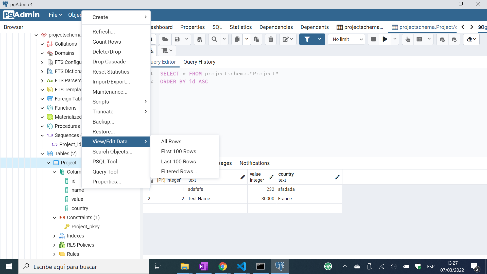

# :zap: Next Prisma Postgresql

* PostgreSQL database with Prisma & Next.js (React) to display project data
* **Note:** to open web links in a new window use: _ctrl+click on link_


## :page_facing_up: Table of contents

* [:zap: Next Prisma Postgresql](#zap-next-prisma-postgresql)
  * [:page_facing_up: Table of contents](#page_facing_up-table-of-contents)
  * [:books: General Info](#books-general-info)
  * [:camera: Screenshots](#camera-screenshots)
  * [:signal_strength: Technologies](#signal_strength-technologies)
  * [:floppy_disk: Setup](#floppy_disk-setup)
  * [:computer: Code Examples](#computer-code-examples)
  * [:clipboard: Status & To-Do List](#clipboard-status--to-do-list)
  * [:clap: Inspiration](#clap-inspiration)
  * [:file_folder: License](#file_folder-license)
  * [:envelope: Contact](#envelope-contact)

## :books: General info

* Prisma uses a schema to define the app's data source (postgresql database), generator (client) and data model (Project). Written using Prisma Schema Language (PSL)

## :camera: Screenshots



## :signal_strength: Technologies

* [PostgreSQL v14](https://www.postgresql.org/)
* [PostgreSQL Installer for Windows](https://www.postgresqltutorial.com/install-postgresql/)
* [Prisma PostgreSQL toolkit](https://www.prisma.io/) Next-generation Node.js and TypeScript ORM
* [Next.js v12](https://nextjs.org/) React framework
* [React v17](https://reactjs.org/) Javascript library

## :floppy_disk: Setup

* Install [PostgreSQL](https://www.postgresql.org/) & run it (requires the password you created during installation). I started PostgreSQL from my Windows 10 PostgreSQL 14 dropdown option 'SQL shell (psql)'
* Add postgresql database URL to a new `.env` file in the root - see `.env example`

* `npm i` to install dependencies
* `prisma migrate dev --name init` to create first Prisma migration and make Prisma schema in sync with database schema and start migration history
* `prisma migrate dev` to sync Prisma schema
* `npm run dev` runs the app in the development mode. Open [http://localhost:3000](http://localhost:3000) to view it in the browser.
* `npm run build` Builds the app for production to the `build` folder. It correctly bundles React in production mode and optimizes the build for the best performance. The build is minified and the filenames include the hashes.

* Postgresql shell commands: `\l` list all databases. `\c datadb` connect to database1. `\dt` inspect tables. `\q` to quit.

## :computer: Code Examples - Backend

* SQL to create a table

```sql
CREATE TABLE projectschema.Project(
   ID       INT              NOT NULL,
   NAME     VARCHAR (20)     NOT NULL,
   VALUE    INT              NOT NULL,
   COUNTRY  CHAR (25),
   PRIMARY KEY (ID)
);
```

## :cool: Features

* None as yet

## :clipboard: Status & To-Do List

* Status: Working
* To-Do: Improve

## :clap: Inspiration/General Tools

* [PostgreSQL Quick Command List](http://jcsites.juniata.edu/faculty/rhodes/dbms/pgsql.htm)
* [SQLShack: Aveek Das: An overview of PGAdmin – PostgreSQL Management Tool](https://www.sqlshack.com/an-overview-of-pgadmin-postgresql-management-tool/)

## :file_folder: License

* This project is licensed under the terms of the MIT license.

## :envelope: Contact

* Repo created by [ABateman](https://github.com/AndrewJBateman), email: gomezbateman@yahoo.com